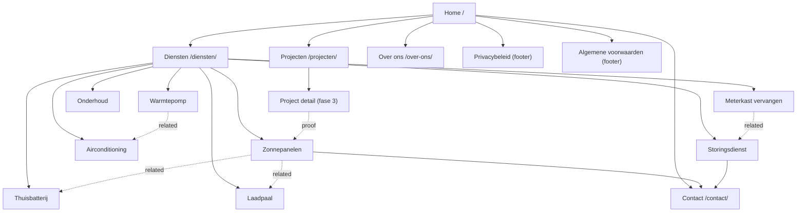

# Vonk Elektra — Site Architecture

**Site type:** small business / local services (installer)
**Primary goal:** phone calls and quote requests from Nijmegen and the surrounding area
**Audiences:** homeowners planning a sustainability step (solar, battery, heat pump, AC, charger) · homeowners with an urgent fault · small businesses needing an electrician they can call again

---

## What is wrong with the current structure

Four pages. All eight services collapsed onto one page as scroll anchors. That produces three concrete problems:

1. **Nothing rankable per service.** `#zonnepanelen` is not a URL. Google indexes pages, not fragments. Eight services competing through one page means seven of them have nowhere to rank.
2. **Portfolio is welded to services.** "Services & Portfolio" is two different jobs on one page — one commercial, one proof. They deserve separate URLs and separate intents.
3. **Navigation dead-ends.** The footer's four service links all point at `#services` on the current page. The nav has no route into any individual service.

Everything else is sound: only four items in the nav, contact styled as the CTA, logo linking home, consistent footer. Keep that shape — just give it somewhere to point.

---

## Recommended hierarchy

This is the Dutch tree, and the Dutch tree is the site: Dutch is the default locale and is
served from the root, with no chooser and no redirect in front of the homepage. English mirrors
the same shape one level down at `/en/…` (`/en/services/`, `/en/about/`, …). See `I18N.md` for
the pairings and the hreflang rules.

```
Home (/)
├── Diensten (/diensten/)
│   ├── Zonnepanelen (/diensten/zonnepanelen/)
│   ├── Thuisbatterij (/diensten/thuisbatterij/)
│   ├── Laadpaal (/diensten/laadpaal/)
│   ├── Airconditioning (/diensten/airconditioning/)
│   ├── Warmtepomp (/diensten/warmtepomp/)
│   ├── Meterkast vervangen (/diensten/meterkast-vervangen/)
│   ├── Storingsdienst (/diensten/storingsdienst/)
│   └── Onderhoud & klussen (/diensten/onderhoud/)
├── Projecten (/projecten/)
│   └── [project]/ (/projecten/{slug}/)          ← phase 3
├── Over ons (/over-ons/)
├── Contact (/contact/)
├── Privacybeleid (/privacybeleid/)              ← footer only
└── Algemene voorwaarden (/algemene-voorwaarden/) ← footer only

Phase 3, only where you can write genuinely local content:
└── Werkgebied (/werkgebied/)
    ├── /werkgebied/beuningen/
    ├── /werkgebied/wijchen/
    ├── /werkgebied/malden/
    ├── /werkgebied/groesbeek/
    └── /werkgebied/elst/
```

Two levels deep, everything within two clicks of home. For a business this size, going flatter than this would cost you the service pages; going deeper would bury them.

### Visual sitemap



---

## URL map

| Page | URL | Parent | Nav location | Priority |
|------|-----|--------|--------------|----------|
| Home | `/` | — | Logo + nav | High |
| Diensten (hub) | `/diensten/` | Home | Header | High |
| Zonnepanelen | `/diensten/zonnepanelen/` | Diensten | Dropdown | High |
| Thuisbatterij | `/diensten/thuisbatterij/` | Diensten | Dropdown | High |
| Laadpaal | `/diensten/laadpaal/` | Diensten | Dropdown | High |
| Airconditioning | `/diensten/airconditioning/` | Diensten | Dropdown | High |
| Warmtepomp | `/diensten/warmtepomp/` | Diensten | Dropdown | High |
| Meterkast vervangen | `/diensten/meterkast-vervangen/` | Diensten | Dropdown | Medium |
| Storingsdienst | `/diensten/storingsdienst/` | Diensten | Dropdown | High |
| Onderhoud & klussen | `/diensten/onderhoud/` | Diensten | Dropdown | Medium |
| Projecten | `/projecten/` | Home | Header | Medium |
| Over ons | `/over-ons/` | Home | Header | Medium |
| Contact | `/contact/` | Home | Header CTA | High |
| Privacybeleid | `/privacybeleid/` | Home | Footer | Low |
| Algemene voorwaarden | `/algemene-voorwaarden/` | Home | Footer | Low |

### URL conventions

- **Host:** `https://vonkelektra.nl` — no `www`. 301 `www` → apex, and all `http` → `https`.
- **Trailing slash:** always present. 301 the non-slash form.
- **Case:** lowercase only. 301 any mixed-case request.
- **Words:** Dutch, hyphen-separated. `meterkast-vervangen`, never `meterkast_vervangen` or `meterkastVervangen`.
- **No extensions.** The `.dc.html` prototype artefact is already gone; the remaining step is
  dropping `.html` in favour of the directory URLs above.
- **Locale prefix on the secondary language only.** Dutch has no prefix because it is the
  default and lives at the root; English is prefixed `/en/`. Never add a `/nl/` prefix — it
  would put the primary market one redirect further from every link it earns.

### Redirect map from the prototype filenames

If any prototype URL was ever shared or crawled, redirect it. If they never went live, skip this table.

| From | To | Type |
|------|----|------|
| `/Vonk%20Elektra%20Homepage.dc.html` | `/` | 301 |
| `/Services%20&%20Portfolio.dc.html` | `/diensten/` | 301 |
| `/About.dc.html` | `/over-ons/` | 301 |
| `/Contact.dc.html` | `/contact/` | 301 |
| `/nl/*` (the short-lived two-folder layout) | `/*` | 301 |
| `/diensten.html` | `/diensten/` | 301 |
| `/over-ons.html` | `/over-ons/` | 301 |
| `/contact.html` | `/contact/` | 301 |
| `/en/services.html` | `/en/services/` | 301 |
| `/en/about.html` | `/en/about/` | 301 |
| `/en/contact.html` | `/en/contact/` | 301 |

The `.dc.html` and `/nl/` rows are written out in `seo/redirects/`; the `.html` → directory rows
belong to the not-yet-done move described above and are listed here so the two passes are not
forgotten separately.

Note the split: the old page was services *and* portfolio. Send it to `/diensten/` — the commercial half — and link `/projecten/` prominently from there.

---

## Navigation spec

### Header

Five items, CTA rightmost. Currently four; "Projecten" is the addition.

```
[logo]   Home   Diensten ▾   Projecten   Over ons        [ Contact ]
```

**Diensten dropdown** — two columns, matching how customers actually think about the two halves of the business:

| Verduurzamen | Elektra |
|--------------|---------|
| Zonnepanelen | Meterkast vervangen |
| Thuisbatterij | Storingsdienst |
| Laadpaal | Onderhoud & klussen |
| Airconditioning | |
| Warmtepomp | |

This split already exists in the code — the `services` array carries `group:0` and `group:1`, which map exactly onto these two columns. Use it.

Below the dropdown, a full-width footer row inside the panel:
`Alle diensten →` (to `/diensten/`) and `Storing? Bel 06 39 69 17 98` in brand orange.

That second link matters more than it looks. Someone with a dead fuse box at 20:00 on a Friday is the highest-intent visitor the site gets, and right now the fastest route to a phone number is scrolling.

**Mobile:** the existing pill nav collapses correctly at 560px. In the drawer, put the storing phone number first, above the nav items.

### Footer

Four columns. The current footer is close — it needs the service links repointed and a legal column added.

| Diensten | Bedrijf | Contact | Juridisch |
|----------|---------|---------|-----------|
| Zonnepanelen | Over ons | De Kluijskamp 1273 | Privacybeleid |
| Thuisbatterij | Projecten | 6545 JK Nijmegen | Algemene voorwaarden |
| Laadpaal | Werkgebied | 024 785 1050 | KvK 90693655 |
| Airconditioning | | 06 39 69 17 98 (storing) | BTW NL865415171B01 |
| Warmtepomp | | info@vonkelektra.nl | |
| Storingsdienst | | | |
| *Alle diensten →* | | | |

Each service link goes to its own page. Four identical `#services` anchors currently waste four internal links per page across every page on the site.

### Breadcrumbs

Add on every page below the top level. They mirror the URL path exactly and give you a free descriptive internal link on every page.

```
Home  ›  Diensten  ›  Zonnepanelen
Home  ›  Projecten  ›  Zonnepanelen Nijmegen-Oost
Home  ›  Contact
```

Every segment links except the current page. Mark them up with `BreadcrumbList` — the JSON-LD is already in `seo/schema/02` and `03`.

---

## Internal linking plan

### Hub and spoke

`/diensten/` is the hub. Each service page is a spoke.

- The hub links to all eight spokes with the service name as anchor text.
- Every spoke links back to the hub ("Alle diensten") and to two or three genuinely related spokes.
- Home links directly to the four highest-value spokes (Zonnepanelen, Warmtepomp, Laadpaal, Storingsdienst), not just to the hub.

### Related-service pairs

Not arbitrary — these are the combinations customers actually buy together, so the link is useful before it is an SEO signal.

| From | Link to | Why |
|------|---------|-----|
| Zonnepanelen | Thuisbatterij, Laadpaal | Store what you generate; charge the car with it |
| Thuisbatterij | Zonnepanelen | Battery without panels is a rare purchase |
| Warmtepomp | Airconditioning, Meterkast | Same comfort decision; usually needs meter-cabinet capacity |
| Laadpaal | Meterkast, Zonnepanelen | Almost always a meter-cabinet question first |
| Storingsdienst | Meterkast, Onderhoud | The fault often reveals an outdated board |
| Onderhoud | Storingsdienst | Prevention and cure, same team |

### Cross-section

- Every service page carries one project card from `/projecten/` for that service — proof exactly where the objection lands.
- Every project page links to the service it demonstrates.
- `/over-ons/` links to `/diensten/` and `/contact/`. An about page without a next step is a dead end.

### Orphan check

Under the current structure there are no orphans, because there are only four pages. After the split, verify:

- [ ] All eight service pages linked from `/diensten/`, the dropdown and the footer
- [ ] `/projecten/` linked from the header and from every service page
- [ ] `/privacybeleid/` and `/algemene-voorwaarden/` linked from the footer on every page
- [ ] Every project detail page linked from `/projecten/` and from its service page
- [x] No link points at a `.dc.html` file — extension dropped, `verify-i18n.py` enforces it
- [ ] No link points at `/nl/`, which no longer exists
- [ ] Every internal link is relative or absolute-with-https — never mixed

---

## Build order

**Phase 1 — launch.** Home, `/diensten/` hub, all eight service pages, `/over-ons/`, `/contact/`, both legal pages. Header dropdown, rebuilt footer, breadcrumbs.

**Phase 2 — weeks 2–6.** `/projecten/` index with three to five real jobs, each linked to its service.

**Phase 3 — months 2–4.** `/werkgebied/` plus town pages, and only for towns where you can write something genuinely specific — the jobs you have done there, travel time, local grid quirks. Five thin near-duplicate town pages will hurt the whole site more than five missing pages ever would.
